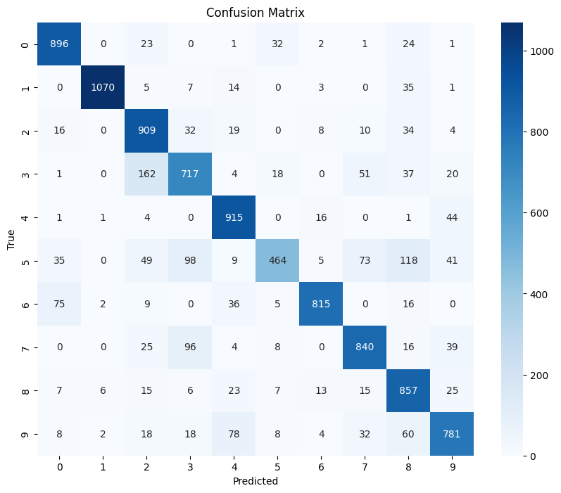
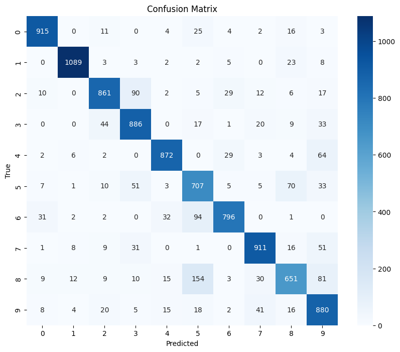

# Baseline Comparison
As a baseline comparison for the performance, subsets of size equal to the compressed model were extracted from the MNIST dataset
- Gradient-Based Clustering
- Random Subset Selection

Each model was evaluated using a CNN classifier

---

# Gradient-Based Exemplar Clustering
Optimization problem:
$$
\arg \min_{S, \gamma_j \geq 0} |S| \quad \text{s.t.} \quad \max_{w \in W} ||\nabla_w F(w, V) - \nabla_w F(w, S)|| \leq \epsilon
$$

1. Train a model (1-3 epochs)
2. Extract last layer gradients
3. k-medoids++ algorithm for exemplar cluster selection 

---
# Baseline Results
### Random Subset
- Test Accuracy on the 10000 test images: 82.64%

---
# Baseline Results
### Gradient Clustering
- Test Accuracy on the 10000 test images: 85.68%

---

# GMM Compression Results
### Auto-Encoder
- Test Accuracy on the 10000 test images: 
 

---
# References
Bishop, Christopher M., and Nasser M. Nasrabadi. Pattern recognition and machine learning. Vol. 4. No. 4. New York: springer, 2006.

Hinton, Geoffrey E., and Ruslan R. Salakhutdinov. "Reducing the dimensionality of data with neural networks." science 313.5786 (2006): 504-507.

Kingma, Diederik P. "Auto-encoding variational bayes." arXiv preprint arXiv:1312.6114 (2013).